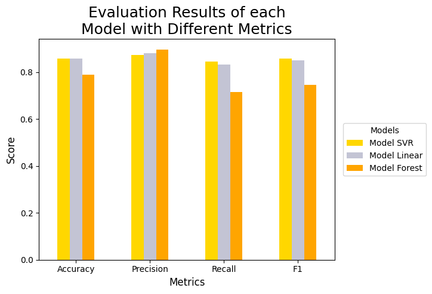

# Model for Classifying a Country's Income
## Abstract
This project aims to create a supervised learning model for the classification of a country's income based on its economic factors.

## Author, Affiliation and Contact
Alexis Aguilar [Student of Bachelor's Degree in "Tecnologías para la Información en Ciencias" at Universidad Nacional Autónoma de México [UNAM](https://www.unam.mx/)]: alexis.uaguilaru@gmail.com

Project developed for the subject "Sociedad de la Información, del Conocimiento y del Aprendizaje" (Data Science Introduction) for the class taught in semester 2025-2.

## License
Project under [MIT License](LICENSE)

## Introduction
Being able to predict a country's Gross Domestic Product (GDP) based on certain economic factors provides a general overview of the country's situation. In general, it could be derived towards other implications of a more social nature such as security, happiness and health of the inhabitants, among others [[1]](#references). For testing this, both an Exploratory Data Analysis and the evaluation of different Machine Learning models are performed to discover possible relationships between economic factors and the GDP of a country or if it is necessary to consider non-economic factors to predict with greater certainty the value of the GDP of a country.

## General Aim
The purpose of the following work is to present the process used to perform the Exploratory Data Analysis (including data cleaning and wrangling) and the definition and evaluation of the classification model. In order to accomplish what has been requested and required in [[2]](#references).

## Exploratory Data Analysis (EDA)
The process related to Data Wrangling and Cleaning is found in [Exploratory Data Analysis](./ExploratoryDataAnalysis/ExploratoryDataAnalysis.ipynb), also the exploration of the dataset is performed in order to obtain relevant information and insights for the creation of the model and possible interactions between features and target, being that the classes are linearly separable the most relevant one. From the former, a preprocessed dataset is obtained for the training of Machine Learning models.

## Models Definition
The process related to Models Definition is found in [Models: Model Architectures](./MachineLearningModels/Models.ipynb#3-model-architectures), where the use of regression models together with the rule defined in [[1]](#references) to classify a country according to its income type is justified. Three different models are presented: one based on Support Vector Machine (SVM with linear kernel) [[3]](#references); another on Linear Regression with L2 penalty (Ridge) [[4]](#references); and the last one on Random Forest [[5]](#references).

## Models Evaluation
After performing the fine-tuning of the models using Cross-Validation with 5 folds ($k=5$) developed in [Models: Models Fine-Tuning](./MachineLearningModels/Models.ipynb#4-models-fine-tuning), the models obtained are evaluated with different metrics on the data set reserved for evaluation. As stated in [Models: Models Evaluation and Selection](./MachineLearningModels/Models.ipynb#5-models-evaluation-and-selection), SVM and Ridge models are found to be the best for the classification problem.

  

## Models Selection
Taking into account that the evaluation results of the models together with technical considerations (specific to the models), in [Models: Models Evaluation and Selection](./MachineLearningModels/Models.ipynb#5-models-evaluation-and-selection) it was decided that the best model is the one based on SVM because it reports good scores as its definition favors what was observed by means of the plots in [Exploratory Data Analysis](./ExploratoryDataAnalysis/ExploratoryDataAnalysis.ipynb).

## Conclusions
Economic factors not only influence the GDP of a country, its type of income, but there are interactions with other non-economic factors that allow determining the GDP with greater certainty. For this reason, it is not possible to have higher metrics, because it may happen that two countries have almost equal economic factors and each one belongs to different types of income, making it impossible for the model to learn to distinguish these cases. Hence, it is mentioned that considering other factors can increase the different metrics of the model and therefore support that the GDP of a country does not only depend on economic factors.

## References
* [1] Proto, E., & Rustichini, A. (2013). A reassessment of the relationship between GDP and life satisfaction. PloS one, 8(11), e79358.
* [2] [Proyecto 2: *Métricas y Validación Cruzada*](RequirementsDocument.pdf). Tinoco Martinez Sergio Rogelio
* [3] Support Vector Machines. scikit-learn developers. https://scikit-learn.org/stable/modules/svm.html
* [4] Linear Models. scikit-learn developers. https://scikit-learn.org/stable/modules/linear_model.html
* [5] Ensembles: Gradient boosting, random forests, bagging, voting, stacking. scikit-learn developers. https://scikit-learn.org/stable/modules/ensemble.html